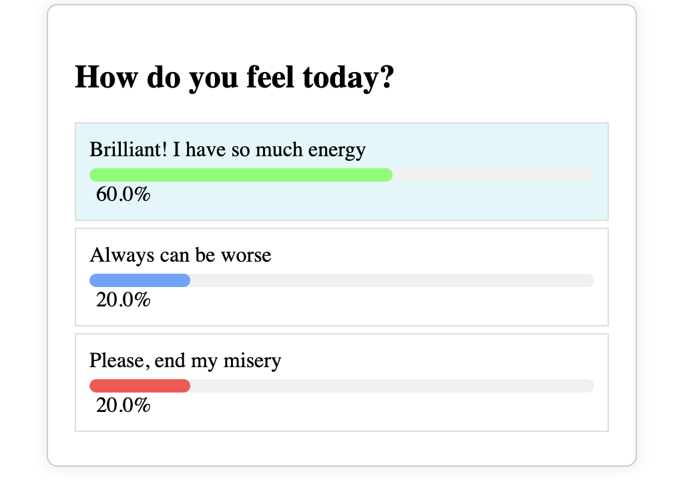

# Poll Widget

A simple and customizable poll widget built as a web component using JavaScript and Web Components API.

## Table of Contents

- [Getting Started](#getting-started)
  - [Prerequisites](#prerequisites)
  - [Installation](#installation)
- [Adding the Widget to HTML](#adding-the-widget-to-html)
- [Support](#support)
- [Technologies Used](#technologies-used)
- [Web Component Support](#web-component-support)
- [Testing](#testing)

## Getting Started

### Prerequisites

Make sure you have [Node.js](https://nodejs.org/) installed on your machine.

### Installation

1. **Clone the repository:**

```bash
    git clone git@github.com:MahranElmasri/poll-widget-app.git
```

2. **Navigate to the project directory:**

```bash
    cd poll-widget
```

3. **Install dependencies:**

```bash
    npm install
```

## Adding the Widget to HTML

To add the Poll Widget to your HTML page, follow these steps:

1. Download the `poll-widget.min.js` and `poll-widget.min.css` files from the repository.
2. Include the following script `<script src="poll-widget.min.js"></script>` tag in the `<head>` section.
3. Include the <poll-widget> tag in body section.

```html
<!DOCTYPE html>
<html lang="en">
  <head>
    <title>Poll Widget Demo</title>
    <script src="poll-widget.min.js"></script>
  </head>
  <body>
    <poll-widget
      question="How do you feel today?"
      options='["Good 😀", "So la la 😕", "Bad 😔"]'
    ></poll-widget>
  </body>
</html>
```

## Support:

- Several polls on the same page are supported by the widget.
- The same poll cannot be used twice on the same page due to the widget.

## Technologies Used

- JavaScript
- Web Components API
- @web/test-runner
- HTML
- CSS

## Web Component Support

Web components are a standardized way to build reusable components for the web.
The Poll Widget is built as a web component,
allowing us to use it across different web frameworks or HTML.

### Testing

```bash
    npm run test
```

## Demo

The Demo HTML pages can be found in the public folder.


